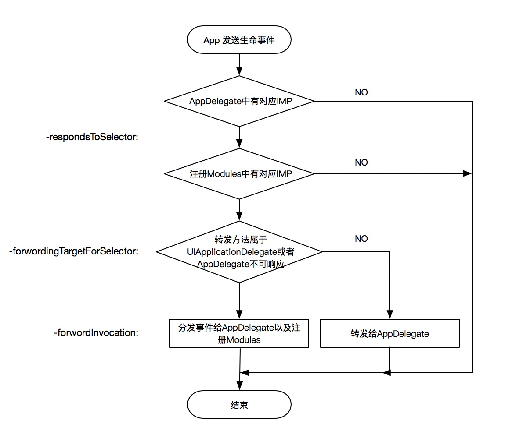

# ZDModuleKit

[](https://travis-ci.org/DevdragonLi/ZDModuleKit)
[](https://cocoapods.org/pods/ZDModuleKit)
[](https://cocoapods.org/pods/ZDModuleKit)
[](https://cocoapods.org/pods/ZDModuleKit)


> 组件生命周期管理

- AppDelegate 作为程序级状态变化的 delegate，应该只做路由和分发的作用，具体逻辑实现代码还是应该在分别的模块中，这个文件应该保持整洁，除了<UIApplicationDelegate>的方法外不应该出现其他方法。

- 

## Example

To run the example project, clone the repo, and run `pod install` from the Example directory first.

- 工程改造参考Demo即可

## Installation

ZDModuleKit is available through CocoaPods. To install
it, simply add the following line to your Podfile:


```ruby
pod 'ZDModuleKit'

```

## Author

DragonLi, dragonli_52171@163.com

## License

ZDModuleKit is available under the MIT license. See the LICENSE file for more info.
